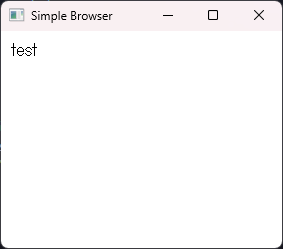

# my javascript engine test

try javascript engine test

> this repository using ai assistant to generate code

### using ai assistant
- Gemini https://ai.google.dev/gemini
- GitHub Copilot https://gh.io/copilot

# install and build

```bash
git clone https://github.com/nknighta/myjs_eg
cd myjs_eg
make all
```

# run

```bash
.\build\window_app.exe .\samples\sample.html
```

